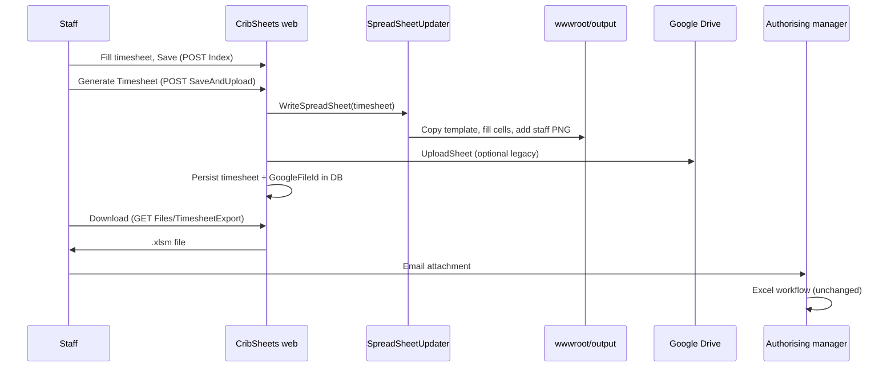

# Legacy timesheet export spec

Reference for porting CribSheets Excel generation to `cribsheets-web`. Describes **observed behaviour** in the legacy repo, not desired redesign.

## Source of truth

| Item | Location |
|------|----------|
| Legacy repo | [lockstock123/CribSheets](https://github.com/lockstock123/CribSheets) |
| Local junction | `legacy/CribSheets` → sibling `../CribSheets` (`bun run setup:legacy`) |
| Excel writer | `SAAS timesheet console/SAAS timesheet console/SpreadSheetUpdater.cs` |
| Domain models | `SAAS timesheet console/SAAS timesheet console/Models.cs` |
| Web orchestration | `CribSheets/Controllers/HomeController.cs`, `FilesController.cs` |
| Templates (copy to output on build) | `CribSheets/template.xlsm`, `CribSheets/template_casual.xlsm` |

**Branch note (checked 2026-03):**

- **`main`** — production baseline (split name, locks, Drive update-by-id, admin UI).
- **`feature/country-employees`** — 11 commits ahead of `main`: `IsCountryEmployee`, country day columns, `SchemaMigrator`, error logging. Templates are **byte-identical** to `main`; country fields use existing sheet columns.
- **`preview`** — stale; fully merged into `main`.

Spec text below matches **`feature/country-employees`** tip (includes country employee). If production IIS is still on `main`, omit country sections until that branch is deployed.

---

## Product constraints (non-negotiable for export)

1. **Staff** use the web app for efficiency; **authorising managers** must not need the app. After generate, staff **download** the `.xlsm` and **email** it—same as a hand-filled FRM-403 from the manager’s point of view.
2. **Authoriser signature** is **not** written by the app. Legacy only embeds the **employee** signature. The authoriser completes sign-off in **Excel** (macros/buttons/template tabs) like today.
3. Output must remain a **macro-enabled `.xlsm`** with template structure intact (VBA, ActiveX, reference sheets, signature tabs)—not a stripped `.xlsx` or PDF-only substitute unless the org already accepts that for manual forms.

---

## End-to-end flow (legacy web)

| Step | Endpoint / action | Behaviour |
|------|-------------------|-----------|
| Profile | `POST Profile` | Staff signature saved as `wwwroot/signatures/{userId}.png` (required for `ProfileIsComplete`). |
| Save draft | `POST Index` | Timesheet JSON in SQL Server; **no** Excel file. |
| Generate | `POST Home/SaveAndUpload` | `WriteSpreadSheet` → `UploadSheet` → `Dal.UpdateTimesheet`. UI hides Generate, shows Download. |
| Download | `GET Files/TimesheetExport?fortnightEnding=` | Serves existing file from `wwwroot/output/` if `HasOutput`; MIME `application/vnd.ms-excel.sheet.macroEnabled.12`. |

**New app intent:** keep generate + download parity; **Google Drive upload is optional to drop** (legacy still calls it on every generate).

---

## Generate algorithm (`WriteSpreadSheet`)

1. **Lock** per `timesheet.ExcelFilePath` (`ConcurrentDictionary`).
2. If `HasOutput`, **delete** previous output file.
3. **Copy** base workbook:
   - `User.Casual == false` → `template.xlsm`
   - `User.Casual == true` → `template_casual.xlsm`
4. Open with **EPPlus 7**; select **data sheet**:
   - Permanent: `Worksheets[0]` → tab **Timesheet**
   - Casual: `Worksheets[1]` → tab **Timesheet - CASUAL**
   - (Index `0` is always **Timesheet**; casual staff data goes on index `1`, not on the permanent Timesheet tab.)
5. Write cells and **one** picture (staff signature); `package.Save()`.

**Not modified by code:** other worksheets, VBA, ActiveX, `Sheet2` lookup data, `signature_employee` / `signature_authoriser` content (except whatever EPPlus touches implicitly on save), authoriser placeholder image on `signature_authoriser`.

---

## Workbook layout (both templates)

Tab order in `template.xlsm` / `template_casual.xlsm`:

| Index | Tab name | App writes? | Role |
|------:|----------|---------------|------|
| 0 | Timesheet | Permanent staff **yes** | Main FRM-403; formulas include `VLOOKUP` → `Sheet2!$L:$M` |
| 1 | Timesheet - CASUAL | Casual staff **yes** | Alternate layout; permanent exports leave this tab blank |
| 2 | Sheet2 | **No** | `cost_centre_list`, `station_list`; required for formulas on data sheet |
| 3 | signature_employee | **No** | Named range `signature` → `A1` |
| 4 | signature_authoriser | **No** | Named range `signature2` → `A1`; template placeholder for later manager sign-off |

Template version string shown in UI: **`Worksheets[0].AD1`** via `GetTemplateVersion(casual)`.

---

## Output filename

From `Timesheet.ExcelFileName` (Models):

`{FIRSTNAME}{RestOfName}-{EmployeeNumber}-Timesheet-{UnitStation}-{ddMMyyyy}.xlsm`

- First token of `User.Name` (uppercased) + remainder of name after first space.
- Written under `wwwroot/output/{ExcelFileName}`.

---

## Cell mapping (data sheet)

Row for day *i* (0–13): **`row = i + 20`**. Fortnight days are built in `Timesheet` ctor from `FortnightEnding` backward 13 days, then reversed (oldest first).

### Header / identity

| Cell | Source | Notes |
|------|--------|--------|
| `AA8` | `FortnightEnding` | `dd/MM/yyyy` (also set once on `Worksheets.First()` before sheet switch) |
| `F5` | `User.Name` | **Surname** — last whitespace-separated token |
| `S5` | `User.Name` | **First name(s)** — everything before last token |
| `AA5` | `User.EmployeeNumber` | |
| `D8` | `User.UnitStation` | |
| `M8` / `M9` | `User.IsCountryEmployee` | Country: tick `ü` in **M8**, clear M9. Metro: tick **M9**, clear M8. (`feature/country-employees`) |
| `BB35` | `ExcessOnCallHoursClaimed` | Country only, if non-empty |

### Per-day grid (rows 20–33)

| Cell | Field | Format |
|------|-------|--------|
| `B{row}` | `day.Date` | `dd/MM/yyyy` |
| `C{row}` | `Start` | `HH:mm` if set |
| `D{row}` | `End` | `HH:mm` if set |
| `E{row}` | Meals | `ToStringQWithTotalHours()` |
| `F{row}` | Rostered | `ToStringQWithTotalHours()` |
| `H{row}` | Overtime | `ToStringQWithTotalHours()` |
| `M{row}` | `ShiftCode` | abbreviation if not `None` |
| `N{row}` | `LeaveType` | abbreviation if not `None` |
| `P{row}` | `SickCertificate` | if not `None` |
| `Q{row}` | Leave hours | `ToStringQWithTotalHours()` if set |
| `S{row}` | `AdditionalInformation` | |
| `W{row}` | `UnitStation` | |

### Crib penalties (per day)

Day *i* uses column **`cribColumns[i]`** ∈ `O,Q,S,T,U,V,X,Z,AB,AC,AE,AG,AI,AJ`.

| Row block | Crib slot |
|-----------|-----------|
| 38–43 | `FirstCribPenalty` |
| 46–51 | `SecondCribPenalty` |

Within each block (column = day’s crib column):

| Offset | Content |
|--------|---------|
| +0 | Crib start `HH:mm` if set |
| +1 | Broken time(s) or joined break `Broken` |
| +2 | Restarted time(s) or joined break `Restarted` |
| +3 | `"no crib"` if `NoCrib` |
| +5 | `"✔"` + Times New Roman 12 if `SpoiltMealClaimed` |

### Shift change / KM block (rows 40+, variable index)

When `ShiftChangeNotified` or `Kms` set for a day, write to row **`40 + shiftChanges`**:

| Cell | Content |
|------|---------|
| `AM` | Shift change date `dd/MM/yyyy` |
| `AN` | Shift change time (short time string) |
| `AO` | Shift code abbreviation |
| `AP` | Day date `dd/MM/yy` |
| `AQ` | Kms if set |

After each write, increment `shiftChanges`; **skip** increment slots when count would be 3 or 5 (legacy layout gaps).

### Country employee day block (`IsCountryEmployee`)

Same `row` as day grid:

| Cell | Field |
|------|--------|
| `AL{row}` | Date `dd/MM/yyyy` |
| `AM{row}` | `RecallCaseNumber` |
| `AO{row}` | `RecallStart` `HH:mm` |
| `AP{row}` | `RecallFinish` `HH:mm` |
| `AR{row}` | `RecallAdditionalInformation` |
| `AT{row}` | `RecallUnitStation` |
| `AY{row}` | `OnCallStart` `HH:mm` |
| `BA{row}` | `OnCallFinish` `HH:mm` |
| `BC{row}` | `OnCallAdditionalInformation` |
| `BE{row}` | `OnCallUnitStation` |

---

## Staff signature image

| Property | Value |
|----------|--------|
| Method | `AddImage(sheet, rowIndex: 36, colIndex: 1, path)` — EPPlus `From.Row` / `From.Column` (same indices as legacy) |
| File | `wwwroot/signatures/{User.Id}.png` |
| Format | **PNG** (profile saves canvas on white background) |
| Sizing | Height 82px; width scaled; 2px column/row offset (`Pixel2MTU` = ×9525 EMU) |
| Picture name | `"Signature"` (EPPlus); saved in OOXML as a normal drawing anchor, e.g. **Picture 3** on sheet 1) |
| **Where to look in Excel** | **~row 36, column A** (staff sign-off band), not **S9** |
| **Do not use for staff PNG** | `xl/media/image1.Png` on **Check Box 193** (col S / row 9): **0×0 px** extent in prod — invisible; unrelated to `AddImage(..., 36, 1, ...)` |

Spike: `bun run excel:signature-node` → `output/template-with-signature-node.xlsm` (`legacy-add-signature.ts`: EPPlus-compatible `oneCellAnchor` at row/col **36/1**, 82px height, `xl/media/image1.Png`). Full template fill: xlsx-populate then `addLegacyStaffSignature` (see `cassie-from-template-node.xlsm` in `excel:spike`). **Do not** patch S9 / Check Box 193 for staff PNG.

**Authoriser:** no `AddImage` call; `signature_authoriser` keeps template placeholder until manager acts in Excel.

---

## User flags affecting export

| Flag | Effect |
|------|--------|
| `Casual` | Template file + worksheet index `1` vs `0`; fortnight anchor dates (`FortnightHelper`) |
| `IsCountryEmployee` | M8/M9 ticks; country columns; BB35 |
| `HasSignature` | Required for profile; if true at generate, PNG embedded |

Fortnight anchors: casual `2020-12-20`, permanent `2020-12-27`; valid endings every 14 days from anchor.

---

## Validation / spike alignment

`scripts/excel-spike/cell-refs.ts` tracks a **subset** of permanent-staff cells (header + day grid + crib blocks) for regression against prod examples. It does **not** yet include country columns, shift-change block, signature image, or employment ticks—extend when porting country staff.

Spike entrypoint: `bun run excel:spike` (see `scripts/excel-spike/README.md`).

---

## Explicit non-goals (legacy code does not do)

- Write authoriser signature or alter `signature_authoriser` beyond template defaults.
- Run Excel macros server-side.
- Populate **Timesheet - CASUAL** for permanent staff.
- Flatten formulas to values (formulas on sheet + `Sheet2` must remain for open-in-Excel behaviour).

---

## Migration checklist (cribsheets-web)

- [ ] Reproduce `WriteSpreadSheet` cell map + staff PNG (EPPlus subprocess or proven equivalent).
- [ ] Copy-from-template; preserve VBA/ActiveX/package parts (see excel-spike lessons).
- [ ] Casual vs permanent template + sheet index.
- [ ] Country employee path if deploying `feature/country-employees` parity.
- [ ] Generate → download UX; optional drop Drive upload.
- [ ] Filename convention and macro-enabled MIME type on download.
- [ ] Authoriser path unchanged (email `.xlsm`; manager uses Excel only).

---

## Document history

| Date | Notes |
|------|--------|
| 2026-03-30 | Initial spec from legacy `SpreadSheetUpdater`, controllers, templates, branch diff |
